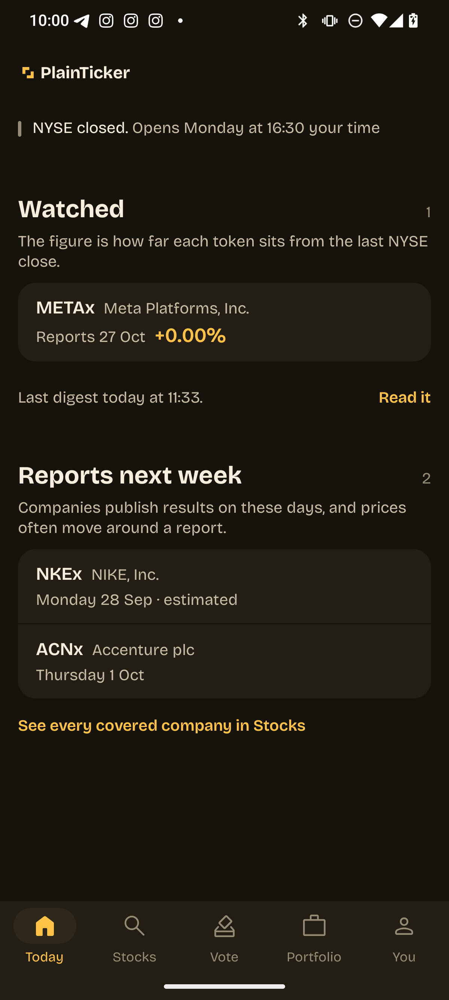
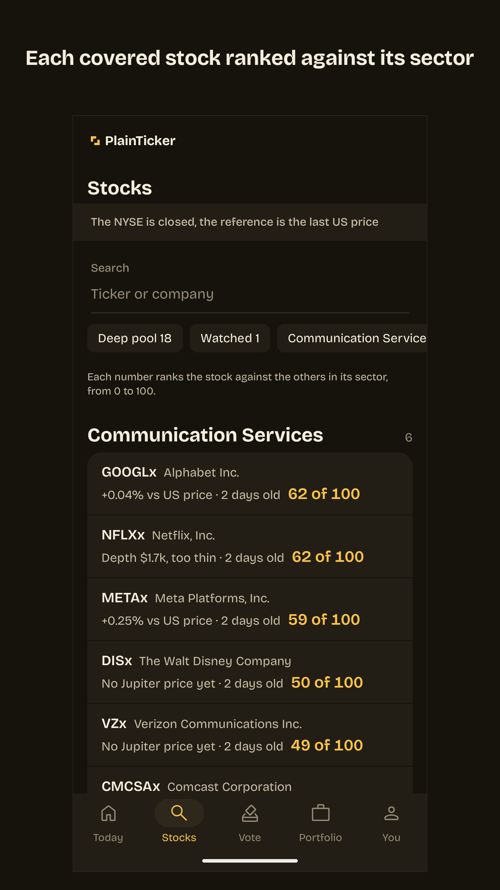
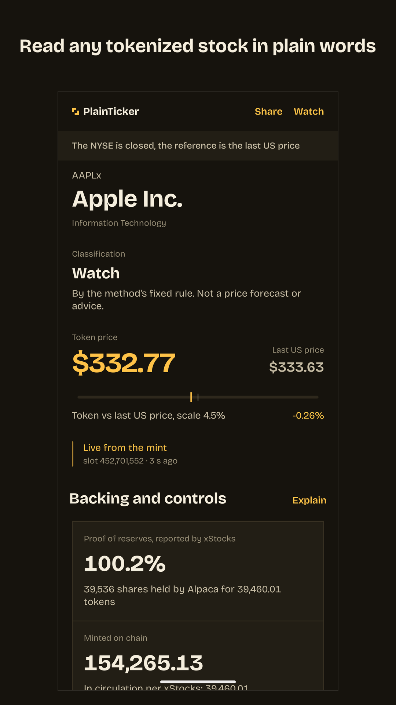
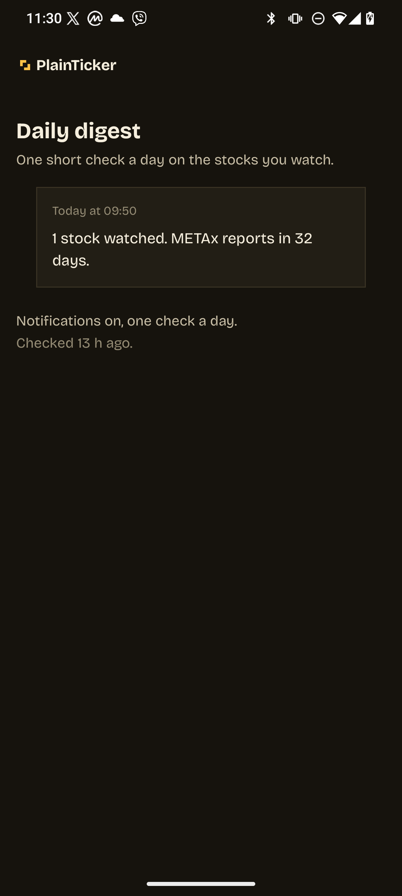
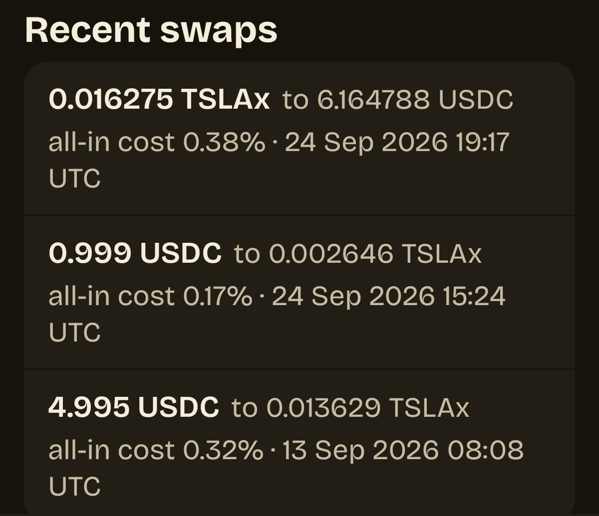

# PlainTicker Mobile

A native Android app for the Solana Seeker that reads a tokenized US stock (an xStock) before you
hold it: the issuer controls and the supply its Token-2022 mint states, read live on the phone, the
reserves xStocks reports, and how the company's SEC filings place it against its sector. Swaps go through Jupiter and are
signed in the Seed Vault through Mobile Wallet Adapter. Staked SKR decides which stock gets
analysed next.

Kotlin and Jetpack Compose, package `com.plainticker.mobile`, built from 10 September 2026 for
CLOCK IN, the Solana Mobile hackathon. This README describes **1.3.27**, released 29 September,
on main and the latest published release.

The analysis is a classification by a fixed rule against the sector. It is not a price forecast
and not investment advice. xStocks are tokenized tracker instruments issued by a third party and
are not available to US persons; the app asks for that self-certification on its first screen.

## Try it in two minutes

1. **Install the signed APK:**
   `https://github.com/louraider/plainticker-mobile/releases/latest/download/plainticker.apk`.
   The link is stable and always serves the latest release (1.3.27 today), built and signed by CI.
   The signing certificate's SHA-256 is
   `66ce92eafa2f819b9a2f6e4eeddc33ac51be46644c295a02750231b1229a49af`, the one
   `https://www.plainticker.com/.well-known/assetlinks.json` names, so the Seed Vault Wallet shows
   the app as `www.plainticker.com`. Check it with `apksigner verify --print-certs plainticker.apk`.
   A Seeker is the target; any Android 8+ phone with a Mobile Wallet Adapter wallet runs it.
2. **First run, about 30 seconds.** The splash is the amber mark. Onboarding asks the US-person
   self-certification, then shows one skippable screen, *Every tokenized stock has controls*
   (backing, issuer powers, splits), then lets you pick stocks to watch, so Today opens with rows.
3. **Turn on Pro with a promo code.** Open **You → Plan → Have a code?**, type a code in the form
   `PT-XXXX-XXXX-XXXX` (the real codes are in the submission form, not in this repository) and tap
   Apply. Each one adds 30 days of Pro, which opens every figure on every covered stock. No wallet
   and no sign-in are needed. If you then sign in with Google, the Pro days move to that Google
   account (see [Pro](#pro)).
4. **What to look at:**
   - **A stock page's trust card.** Stocks → search `AAPL` → open AAPLx. Under the price, *Live
     from the mint* names the slot it read and how many seconds ago. *Backing and controls* reads
     the Token-2022 mint on this phone each time the page opens: the supply minted on chain, the
     permanent delegate and its address, pausable transfers, the split multiplier and the transfer
     hook. Beside them sit the proof of reserves and the circulating count, which xStocks reports.
     The app does not read reserves from the chain. **Explain** on the section head opens *What
     backing and controls mean*: each row with what it is and why it matters, and a link to the
     same explainer on the web,
     [plainticker.com/en/learn/backing-and-controls](https://www.plainticker.com/en/learn/backing-and-controls).
   - **Share.** Share on a stock page sends a 1080 × 1350 image card (delegate, reserves, supply,
     the token against its US price) with the text and link. A landed vote and a landed swap
     have their own cards.
   - **A swap and its receipt.** On the same page, swap 1 USDC into the token. The app decodes the
     transaction before the wallet opens. A Review step then shows what you spend, the least you
     receive, the network fee read from the transaction, the token account deposit as an upper
     bound ("Up to X SOL", returned if the account is closed) and the all-in cost. **Continue to
     wallet** is the only way on. The wallet sheet names `www.plainticker.com`. When the wallet
     hands the signed transaction back, the phone checks it again before it is sent. The result
     screen reads *Swap landed* under a check mark, with what was received; the receipt keeps the
     executed fill plus estimated network costs, and the signature. Portfolio then offers **Swap
     to USDC** for the way back. This needs a wallet holding a few USDC and about 0.01 SOL. If
     Jupiter refuses, the sheet says which refusal it was: busy (rate limited), no route for this
     token, or no connection, with nothing sent.
   - **The Vote tab.** *Last round* shows the round that closed most recently: round 2, which AAL
     won on 28 September. Round 1's winner, JEF, is now analysed (open JEFx from Stocks). Cast a
     vote for any uncovered US stock in the current round. A vote is a transaction you sign,
     weighted by the SKR your wallet has staked. A wallet with no stake is told its vote would
     carry no weight before anything is signed. The result reads *Your vote is on chain*. *Your
     votes* also lists the connected wallet's votes from earlier rounds, the most recent round
     first.

| Today | Stocks | A stock page |
|---|---|---|
|  |  |  |

| The daily digest | Swaps this app made on mainnet |
|---|---|
|  |  |

All five screenshots were captured on a Seeker (1200 × 2670) from builds 1.3.8 to 1.3.12, so they
predate the 1.3.27 labels: the stock page now names its reference *Last US price* while the NYSE
is shut, and *Backing and controls* has its Explain action. The last one is
cropped from Portfolio and lists the three swaps in the proof table below.

## What it is and who it is for

**The person:** someone with a Seeker and some USDC who has seen tokenized stocks in their wallet
and wants to know what a token is before it is theirs. A swap screen gives them a ticker and a
price. PlainTicker gives them three things that screen does not.

- **What the token is.** The chain facts, read from the mint on the phone. Some of these can matter
  more than any fundamental: an issuer holding a permanent delegate can move the token out of a
  wallet without the owner's signature. The app says so in plain words ("Issuer can move tokens").
  A mint that could not be read is drawn as unknown, never as no risk.
- **What the company is.** PlainTicker's classification of the company's SEC EDGAR filings
  against its sector: quality, valuation and momentum, and the F-Score with its nine signals. The
  age of the analysis is shown on every row. Every number is a position against the sector. None
  of them is a forecast.
- **What the price is worth.** The token's gap to the last US price of the share, labelled *Last
  US price* on the stock page while the NYSE is shut (*NYSE price* during the session). That reference is Jupiter Price v3's `stockData.price`: the share's
  latest US trade, pre-market and after-hours included, so it keeps moving while the NYSE is shut.
  It is not the NYSE close, and no source the app reads carries the regular-session close. The
  gap is drawn only where Jupiter reports at least $4,000 of depth behind the price. Below that floor the app states the
  depth instead ("Depth $34, too thin") and draws no premium. The rule lives in one function,
  `data/jupiter/TrackingQuality.kt`, which every screen reads.

**The daily habit** is Today and the digest. Today opens on the market's state in your own time
zone ("NYSE closed. Opens Monday at 16:30 your time"), then your watched stocks and how far each
token sits from its share's last US price, then *Reports this week* (or *next week* at the weekend), because
prices often move around a company's report. One digest a day arrives as a notification about the
stocks you watch. No other notification is sent.

**Five tabs:** Today, Stocks, Vote, Portfolio, You. Amber visual system, Bricolage Grotesque, dark
and light themes, portrait. `DESIGN.md` is the design system.

## Why it lives on the Seeker

A web page cannot do most of this. The website shares only the analysis engine.

- **Mobile Wallet Adapter 2.2 and the Seed Vault.** Every signature (swap, vote, Pro pass) goes
  through MWA to the Seeker's Seed Vault Wallet. The app never holds a wallet key and never asks for a
  seed phrase. Backing out of the wallet's connect sheet ends the request as cancelled within a
  few seconds, rather than waiting out the adapter's own timeouts.
- **A verified app identity.** The release certificate's SHA-256,
  `66ce92eafa2f819b9a2f6e4eeddc33ac51be46644c295a02750231b1229a49af` (the certificate that signs
  every release, 1.3.27 included, checked with `apksigner` on 2 October), is published in
  `https://www.plainticker.com/.well-known/assetlinks.json` and returned by Google's Digital Asset
  Links API. The wallet's connect sheet therefore names the app `www.plainticker.com` before
  anyone approves anything. A debug build uses another key and does not verify, which is the
  point of the chain (`docs/release-signing.md`).
- **Token-2022 read on the device.** xStocks are Token-2022 mints with the Scaled UI Amount
  extension. The app parses the mint extensions in Kotlin, reads token accounts with the
  Token-2022 program id, and multiplies raw balances by the split multiplier. Without that step a
  holder would see the wrong quantity.
- **SKR decides coverage, and the first loop has closed.** Each analysis costs money to make, and
  most xStocks have none. Staked SKR decides which one is made next. Round 1 ran 14 to 21
  September: JEF won with 878.98 SKR from one voter, the vote landed on mainnet, and JEF
  (Jefferies Financial Group) was analysed on 26 September. Round 2 closed on 28 September with
  AAL on top, again from one voter. Rounds are weekly, closing Monday 00:00 UTC.
- **Phone-native work:** a WorkManager digest with the notification permission asked at the first
  watch, a bundled snapshot drawn when the live list is slow or fails, pull to refresh on Today,
  Stocks and a stock page (it skips the 30-second price cache and holds the indicator until fresh
  figures land), an offline state that says what it is showing and from when, and share images
  (stock, vote and swap cards, 1080 × 1350) drawn on the phone with the platform Canvas and handed
  to the share sheet through a `FileProvider` that is not exported.

## How the vote works

- `POST /api/v1/vote/build` returns an unsigned v0 transaction with two instructions: a
  0-lamport transfer to the collector `2KyWZetthwBAXji88M2Fz5ob4RPbYxCCBBKXueSoS7tJ`, so every vote
  can be found on chain, and a memo `PT-VOTE:<TICKER>`. The wallet signs and sends it. The signer
  is the voter by construction, so no login is involved, and a vote costs one signature fee.
- The weight is the voter's staked SKR principal, read on chain by the server and never sent by
  the app. The server runs one `getProgramAccounts` on the SKR staking program with a `memcmp` at
  byte 41 (the struct is packed), reads the principal as a u64 at byte 105, and bounds it at both
  ends.
- A cron reads the memos every ten minutes and `GET /api/v1/vote/next-up` sums them. Every vote
  is on chain, because each one pays the collector, so anyone can list the same signatures and
  read the same memos. The weight is the stake the server read at tally time, when it counted the
  vote, and it is stored as it was summed.
- The public ledger, `GET /api/v1/vote/rounds/{id}/ledger`, publishes every counted vote of a
  round: signature, voter, ticker, weight, the time and RPC slot at which the stake was read, and
  whether the vote was counted before the round closed. Standard RPC cannot re-read a balance at a
  past slot, so the weights are published, not re-derivable later: a recount made now reads the
  stake as it stands now. The two votes counted before the ledger shipped on 27 September (one in
  round 1, one in round 2) show no read time or slot.
- The ballot holds the 898 US-listed xStocks without an analysis. PlainTicker reads SEC filings, so
  the server accepts only US underlyings (916 in its universe file).
- The sheet states the weakness before the wallet opens: a vote weighted by stake is decided by
  the largest stake. The stored weight is raw and linear, so a cap or a one-Seeker-one-voice rule
  can be applied in the tally alone (see the roadmap).

## Pro

Pro opens every figure on every covered stock. AAPL stays fully open to everyone as the worked
example, and every stock page stays readable on the free plan, with the figures that feed the
classification locked. Pro comes from any one of these:

- a 30-day pass paid from the wallet, **12 USDC**, as a transfer the app decodes before signing;
- **7,500 SKR staked**, for as long as the stake stays in place;
- a subscription on plainticker.com, since the account is shared;
- a promo code (You → Plan → Have a code?).

**Pro belongs to the Google account, not to the phone.** A pass paid or a promo code redeemed on a
phone that is not signed in is kept on that phone, and Plan says so ("Saved to this phone until
you sign in"). Signing in with Google moves those days to the account, and Plan then reads "Moved
to your Google account." A signed-in phone shows only its account's Pro. Signing out removes Pro
from the phone (the sign-out question says so before it happens), and the Pro stays on the
account for the next sign-in, on any phone or on the web. Staked SKR is read from the connected
wallet, so no sign-in moves it. The app re-reads the plan at once after every sign-in and
sign-out, so a previous account's Pro never stays on screen.

Sign-in in the app is **Google** (Credential Manager, with a server-issued nonce that both the
server and the app check). The wallet is a Mobile Wallet Adapter connection: it signs swaps,
votes and the pass, and it is not a sign-in. Signing in with a Solana wallet, and linking one to
the account, happen on www.plainticker.com; the app lists the linked wallets and can unlink one.
One account and one Pro plan are shared with www.plainticker.com.

## Architecture

```
Seeker: Kotlin 2.4, Jetpack Compose, Mobile Wallet Adapter 2.2, Ktor, WorkManager, Credential Manager
|   every chain read parsed on the device; every transaction decoded before the wallet opens
|
|-- PlainTicker API  https://www.plainticker.com/api/v1
|     /summary            the ranked list in one edge-cached call
|     /{TICKER}           the classification payload
|     /rpc                bounded JSON-RPC forwarder; the RPC key stays on the server
|     /vote/*             build, next-up, universe, rounds/{id}/ledger
|     /pass/*, /promo/*   Pro: pass build and confirm, promo redeem, entitlement
|     /auth/google        Google sign-in, with /nonce
|-- xStocks public API    catalog (mints, trading calendar), proof of reserves, split multiplier
|-- Jupiter               Price v3 (token price, the share's last US price, depth), Swap order and execute, keyless
`-- Solana mainnet        Token-2022 mints and token accounts through /rpc; a second public node
                          cross-checks decimals, multiplier and balance before Swap to USDC
```

The analysis engine, its database and its cron existed before the hackathon and are the backend.
No web UI was ported. The web product has no chain read, no swap and no notification.
Everything in this repository was written after 10 September 2026. The server work built for the
phone (`/summary`, `/rpc`, the vote, the pass, promo codes, Google sign-in) landed as pull
requests in the PlainTicker repository. `server/rpc-proxy/` mirrors the forwarder's source and
contract here for audit.

## Security

- **The app and server never hold a user's wallet signing keys.** Every user signature happens in
  the wallet, through Mobile Wallet Adapter. The server builds vote and pass transactions it cannot
  sign. The treasury's and the collector's
  keys are held by the founder, outside every repository and every server.
- **No secrets in the APK.** RPC goes through `/api/v1/rpc`. It accepts one request at a time
  (never a batch) from a five-method read-only allowlist: `getAccountInfo`, `getMultipleAccounts`,
  `getTokenAccountsByOwner`, `getBalance`, and `getProgramAccounts` pinned to one program and one
  filter shape. It caps the body at 16 KiB, rate-limits per IP and per day, and never echoes the
  upstream URL. `sendTransaction` is not on the list. Jupiter is used without a key.
- **Every transaction is decoded on the phone before the wallet opens**
  (`wallet/TransactionGuard.kt`). The screen's figures come from JSON sent beside the bytes, so a
  compromised server or API could show "12 USDC to the treasury" over a transaction that drains
  an account. The guard compares the instructions with the figures shown and with addresses the
  app pins itself (`data/PinnedAddresses.kt`, `data/KnownPrograms.kt`). Changing a pin needs a
  release, not a server setting. A transaction the guard cannot parse is refused, and the refusal
  costs a retry, never money. The guard reads the top level of the message only: the
  cross-program calls Jupiter makes inside its own program, and accounts a swap loads from an
  address lookup table, are outside it. The second table below says what stands in for each.
- **The swap is checked twice: before the wallet opens, and after it signs.** A wallet may change
  a transaction before it signs it (its own priority fee or compute limit, a fresh blockhash), so
  the phone decodes the transaction the wallet actually signed and runs the whole swap guard on it
  again, against the same order and request. The wallet may only change the priority fee, within
  the 0.01 SOL ceiling, or add Lighthouse assertions (`L2TExMFKdjpN9kozasaurPirfHy9P8sbXoAN1qA3S95`);
  the fee payer and signers must be the same and the wallet's signature must be present. Any
  other change (an unknown program, a new destination, a different amount, an Approve) is refused
  and named, and nothing is sent. An allowed fee change updates the sheet and the receipt.
- **Honest errors from Jupiter.** A rate limit reads "Jupiter is busy, try again in a few
  seconds"; *no route* is shown only when Jupiter's answer is about a route; a request that never
  left the phone reads "Jupiter could not be reached. Check the connection and try again. Nothing
  was sent." A quote that comes back
  without a transaction is never called a missing route.
- **The device code is sealed at rest:** the code that carries a device's Pro entitlement, and its
  pending replacement during a rekey, are encrypted with AES-GCM under an Android Keystore key of
  their own, in preferences that backups exclude. An older plain copy is removed only after the
  sealed copy has been read back and opened.
- **Money moves only in a release build.** Jupiter `/execute` sits behind `BuildConfig.SUBMIT_SWAPS`:
  false in debug, true in release. The unit tests run against debug.
- **Repository hygiene.** `scripts/redaction-guard.sh` hashes every base58 candidate in the tree and
  in the full history against a denylist of identifiers that must never appear. The denylist
  holds digests only. The demo wallet and the signatures below are public on purpose, as evidence.
- **Two permissions:** internet, and notifications, asked when the first stock is watched. No
  analytics SDK, no advertising, no tracking.

### What `TransactionGuard` checks, and what it cannot see

| Flow | What is checked before the wallet opens |
|---|---|
| Every server-built transaction (vote, pass) | The fee payer is the connected wallet. The wallet is the only signer. No address lookup tables. Every program is on the flow's allowlist. The fee cannot exceed the one displayed. |
| Vote | Only ComputeBudget, System and Memo. Exactly one 0-lamport transfer, to the pinned collector. Exactly one memo, `PT-VOTE:` plus the ticker the person chose, naming no account but the wallet. |
| Pro pass | The amount can never exceed 12 USDC or 12 USDT, a ceiling pinned in the app. Exactly one SPL Token transfer of exactly the displayed amount, from the wallet's own USDC or USDT account to the pinned treasury's account. Exactly one `PT-PASS` memo for this device. Token accounts are created only for the wallet or the treasury. Any Approve, SetAuthority or CloseAccount is refused. |
| Swap, both directions | The order's mints, amount and taker match what was asked for, and the wallet is a required signer. Exactly one Jupiter instruction, and only `route_v2` or JupiterZ `fill`, whose layouts are known. The amount is read from the instruction bytes, and so is the least the swap may pay out, which cannot be below the figure shown. The account spent from and the account paid into must be the wallet's own for the input and output mints. No top-level transfer or burn. Approve, SetAuthority and CloseAccount may name only the wallet. Token accounts may be opened only for the wallet, only for a mint on the swap or its route, at most two, and no more than the order's declared rent covers. Slippage may not exceed 300 bps, in the order or in the bytes. `route_v2`'s platform fee may not exceed the order's own fee, nor 400 bps. No lamports leave the wallet through System. The priority fee cannot exceed the order's. An order whose fee or rent fields are negative or overflow is refused. The network fee is read from the bytes (5,000 lamports per signature plus the compute-budget price times its limit) and may not exceed the declared one, and declared fees and the derived total are capped at 0.01 SOL. The deposit is shown as an upper bound, each account the wallet funds at its program's largest size, and declared rent above two of the largest accounts is refused. Every SOL figure on the Review step, the sheet and the receipt comes from those checked values. |
| Swap, the transaction the wallet signed | Every rule above, run again on the signed bytes against the same order and request, before `/execute`. Two differences only: the priority fee is bound by the 0.01 SOL ceiling instead of the order's declared fee, and Lighthouse assertion instructions may appear. Same fee payer and signers, a non-zero signature in the wallet's slot; the blockhash may change. A refusal names what the wallet changed. |

| What it cannot see | Why, and what stands in for it |
|---|---|
| What Jupiter does inside its own program: the cross-program invocations to each venue on the route | The bytes show the top-level instructions only. The defence is that Jupiter's two programs are the only swap programs allowed, that the source and destination accounts are pinned to the wallet's own, and that the chain returns the fill, which the receipt reports. |
| Whether the quote is a good price | Not a safety property. The sheet shows the estimated all-in cost before the swap, the order may not allow more than 300 bps of slippage, and the receipt shows the executed fill plus estimated network costs. |
| The fee a landed transaction actually paid | The RPC forwarder allows no method that returns a landed transaction's metadata, so the receipt's network costs are estimated from the checked order. |
| Accounts a swap loads from an address lookup table | They cannot be resolved offline. The authority and both token accounts must be static keys, and a static mint slot must name the requested mint. |
| What the issuer can do to the token after the swap | That is the mint's permanent delegate and pause authority, which the stock page shows before the swap. |

## Proof on mainnet

Every transaction below was made by this app on a Seeker, from the public demo wallet
`9g3mxMEfDhkX1VuNUgmuZFRj4RDiRt6CTvGUPPumUFoQ`.

| When (UTC) | What | Signature | Slot |
|---|---|---|---|
| 13 Sep 08:08 | Swap: 5 USDC into 0.01362917 TSLAx. The receipt reads 4.995 USDC to the route, all-in cost 0.32% | [`5pyP9e1w…awAXHK3F`](https://solscan.io/tx/5pyP9e1wHCGmatBKM8wtzTW33AjtBR7hMv5Xf4RF2fYhYGyioQov76L29ToZaXtTVF1WbsnqJM2zvRu7awAXHK3F) | 446,653,478 |
| 19 Sep 10:02 | Vote canary, memo `PT-VOTE:JEF`, which won round 1 | [`3RZhaQtAy…PmV19yVG`](https://solscan.io/tx/3RZhaQtAySu4CNLdPQjfEKm7y7NZqcukEFLAFJzZLUsLuPpsPadbTb6ZFYmSRXTg2SsqhhHuN1EUjsUnPmV19yVG) | 448,374,697 |
| 20 Sep 07:46 | Pro pass, 12 USDC to the treasury, memo `PT-PASS:…`. The app then read Pro until 20 Oct | [`5Do5uru…x4v5mWN`](https://solscan.io/tx/5Do5ururZ2JVt4Gqu8wdaug1Dd3b9xVrqbUgctwehQaKY2PCFKh19pu9zC196LNnoTxNd12unoHYxApu3v4x5mWN) | 448,668,140 |
| 24 Sep 15:24 | Swap: 1 USDC into TSLAx, all-in cost 0.17% | [`4TmGDAjA…ujzjwksZo`](https://solscan.io/tx/4TmGDAjA3V6BF7TdQyUqfkcAg6rfb3s23jhMx1XkqZtVj8i1enfpWZWGoCQShHcawoms7Jja5ZVaRk1ujzjwksZo) | 450,068,679 |
| 24 Sep 19:17 | Swap to USDC: the whole 0.016275 TSLAx position back into 6.16 USDC, all-in cost 0.38% | [`3pwPVFXG…BuT6xkm`](https://solscan.io/tx/3pwPVFXGxoGcQCNbN1oLxSJuqFS4yHFhsW2522eu76gQ8D5fXtwauBFGUsurhYdJDxFx9QvQUruFQTnBBsuT6xkm) | 450,121,017 |

On 29 September the released 1.3.27 swapped USDC into METAx on a Seeker, signed in the Seed Vault
Wallet, and landed at slot **451,727,576**, after the signed-by-wallet check (see Security)
re-read the transaction the wallet signed. It was made from a private wallet, so its address
and signature are not published here.

## The numbers

Measured on 28 September 2026 unless the row says otherwise.

| What | Number | Source |
|---|---|---|
| Companies covered | **57** companies analysed on plainticker.com, **56** of them with an xStock. Each has its own full page on the web. The app lists the 56: xStocks issues no BABA token, so BABA is covered on the web only. 50 of the 56 carry a classification. ABBV, CMCSA, MA, NKE and V read *Not classified* in Stocks, because their sector has too few companies to compare fairly, and JEF, the round-1 winner, waits for a sector model. Each of the six stock pages names its reason | The server's `covered` list (57 tickers); `GET /api/v1/summary` (51 rows, JEF's without a classification) |
| xStocks with a Solana mint | 1,124 | The live xStocks catalog (commit `22222ea`) |
| On the ballot | 898 US-listed xStocks without an analysis | The app's US filter over the live catalog (commit `22222ea`); the server's universe file accepts 916 US tickers (`GET /api/v1/vote/universe`) |
| Commits | 503 on main since 10 September (414 without merges) | `git rev-list --count` at 1.3.27 (`5e8b61f`) |
| Pull requests | 79 opened, 78 merged, by the 1.3.27 release | `gh pr list --state all` |
| Unit tests | 2,118 passing at 1.3.27 | Pull request #79; CI run 36600780950 on `5e8b61f`, green |
| Mainnet transactions from the app | The five in the table above, one of each flow and direction. The demo wallet has made more since, including the round-2 vote for AAL on 27 September that won that round | The table above; the round-2 ledger |
| Pro | 12 USDC for 30 days, or 7,500 SKR staked | plainticker.com's billing constant `STAKE_ENTITLEMENT_THRESHOLD_SKR` |

## Honest limits

- **All usage so far is the founder's.** Every transaction above came from the demo wallet. Round 1
  had one voter, and round 2, which closed on 28 September, had one vote, also from the demo
  wallet (the round-2 ledger). Round 3 runs 28 September to 5 October. Nothing here claims users
  the app does not have.
- **Coverage is 57 companies analysed on plainticker.com, 56 of them with an xStock, against 1,124
  xStocks.** The vote exists because of that gap, and it closes it one company a week.
- **Not every covered company has a classification.** Six of the 56 in the app have none yet:
  ABBV, CMCSA, MA, NKE and V, because their sector has too few companies to compare fairly, and
  JEF, until a sector model for banks and capital-markets firms is ready. Their stock pages keep
  the available figures and say why.
- **The vote is decided by the largest stake.** The app says so where the vote is cast. A
  one-Seeker-one-voice weight is on the roadmap.
- **Not on the Solana dApp Store yet.** The publisher account and KYC are done, the signing chain
  is live, and the listing copy is written (`docs/dapp-store-publishing.md`). The first release,
  built from 1.3.27, has not been submitted for review yet (2 October).
- **Portfolio shows no profit and loss**, because the chain carries no cost basis.
- **Some figures read "not available for this filer"** for young or loss-making companies, rather
  than being estimated.
- **Portrait only.**

## Run it

Android Studio with the API 37 SDK (`compileSdk 37`, `minSdk 26`), JDK 17 or 21, and a phone with a
Mobile Wallet Adapter wallet.

```
./gradlew :app:testDebugUnitTest    # 2,118 unit tests at 1.3.27
./gradlew :app:assembleDebug        # debug: signs a swap, never submits it
./gradlew :app:assembleRelease      # release: env-driven signing, docs/release-signing.md
scripts/device-smoke.sh             # assertions against a connected phone
scripts/redaction-guard.sh          # the tree and the full history against the denylist
```

CI is green. GitHub Actions runs the unit suite and the redaction guard on every push and pull
request, and builds and signs every release from a `v*` tag (1.3.16 to 1.3.27 so far). The release
job refuses a tag whose commit is not on `main`, and it runs in the protected `release`
environment, so nothing is built or signed until the founder approves the run. Each release
carries the APK twice: `plainticker-<version>.apk`, and `plainticker.apk`, which the stable link
above serves from the latest release. Both are CI builds; the 1.3.27 APK's certificate was
checked with `apksigner` on 2 October against the SHA-256 above.

## Where things are

`app/src/main/java/com/plainticker/mobile/`: `ui/` holds the screens (today, stocks, detail, swap,
portfolio, vote, you, pass), `wallet/` the MWA session and `TransactionGuard`, `data/` the API,
Jupiter, xStocks and RPC clients, and `watchlist/` the digest worker.

`DESIGN.md` is the design system, `docs/skr-curation-spec-2026-09-13.md` the vote's
specification, `docs/release-signing.md` the signing chain, `docs/qa-checklist.md` the device walk,
`docs/dapp-store-publishing.md` the publishing route and listing copy, `docs/deck.md` the deck, and
`docs/video-script-2026-09-27.md` the demo script.

## Attribution

Analysis by PlainTicker. Token catalog and proof of reserves by xStocks (Backed Finance). Prices and
routing by Jupiter. Filings from SEC EDGAR. Not affiliated with any of them.
